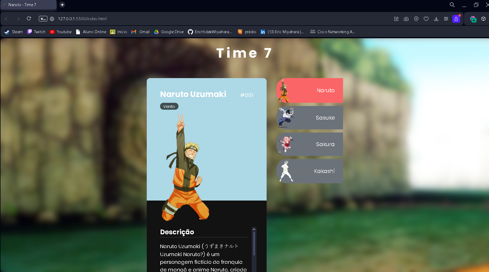

[HTML5]: https://img.shields.io/badge/html5-%23E34F26.svg?style=for-the-badge&logo=html5&logoColor=white
[CSS3]: https://img.shields.io/badge/css3-%231572B6.svg?style=for-the-badge&logo=css3&logoColor=white
[JAVASCRIPT]: https://img.shields.io/badge/JavaScript-323330?style=for-the-badge&logo=javascript&logoColor=F7DF1E
<h1 align="center" style="font-weight: bold;">Naruto - Time 7</h1>

![html][HTML5]
![css][CSS3]
![javascript][JAVASCRIPT]

 <a href="#about">Sobre</a> • 
 <a href="#technologies">Tecnologias utilizadas</a> •
 <a href="#contribute">Contribuição</a> •
 <a href="#links">Links úteis</a> 

   

<h2 id="about">📌 Sobre</h2>

O site "Naruto Time 7" apresenta descrições detalhadas dos personagens principais do Time 7 da série "Naruto", incluindo Naruto Uzumaki, Sasuke Uchiha, Sakura Haruno e Kakashi Hatake. Cada personagem tem informações sobre suas habilidades, história e papel na equipe. É uma fonte dedicada aos fãs da série, destacando os principais protagonistas e suas jornadas.

Você pode acessá-lo [aqui](https://naruto-time7.vercel.app).

<h2 id="technologies">Tecnologias utilizadas</h2>

- **HTML5:** Estrutura da página. 🌐
- **CSS3:** Estilização e animações. 🎨
- **JAVASCRIPT:** Funcionalidades interativas. 💻
- **Flaticon:** Para o ícone. 👍

<h2 id="contribute">📫 Contribuição</h2>

Agradeço a contribuição para o projeto. Se você está corrigindo um bug, adicionando uma funcionalidade, ou melhorando a documentação, sua contribuição é valiosa. Veja como você pode contribuir:

1. **Criar uma nova funcionalidade**

A adição das respectivas imagens com os cards do site é um boa ideia para tornar o site mais atrativo visualmente.

2. **Siga os padrões de codificação**

Consistência é fundamental! Aderir aos padrões de codificação e padrões estabelecidos no projeto. Isso garante a legibilidade e a manutenção do código.

3. **Espere pela revisão**

Irei rever a sua solicitação de pull. Participe da discussão e faça as alterações solicitadas. Suas contribuições serão mescladas no projeto uma vez aprovada!

<h3 id="links">Links Úteis</h3>

- [Projeto](https://naruto-time7.vercel.app)
- [Layout](https://github.com/EricHidekiMiyahara/narutoTime7)

